# Практическое задание №1: Основы работы с Git

**Тема:** ветки, коммиты и разрешение конфликтов
**Выполнил:** Костин Алексей
**Репозиторий:** https://github.com/Asw3x/mireaanotherpne

---

## Цель работы

Освоить базовые принципы работы с системой контроля версий Git: инициализацию репозитория,
создание коммитов, работу с ветками, слияние с конфликтом и его разрешение, а также
синхронизацию с удалённым репозиторием на GitHub.

## Итоговый результат

| Пункт проверки | Статус |
| --- | --- |
| Файл `story.txt` с итоговым содержимым после разрешения конфликта | выполнено |
| История из 5 коммитов (2 в `main`, 1 в `test`, 1 в `main`, 1 коммит слияния) | выполнено |
| Скриншот истории `git log --oneline --graph --all` с ветвлением и слиянием | выполнено |
| Проект опубликован на GitHub | выполнено |
| Отчёт со скриншотами и описанием | этот файл |

---

## Часть 1. Настройка и подготовка

Перед началом работы настроена учётная запись Git — имя и email привязываются к каждому
коммиту и отображаются как автор изменений. Настройка выполняется с флагом `--global`,
то есть применяется ко всем репозиториям пользователя.

```bash
git config --global user.name "Aleksey Kostin"
git config --global user.email "asw3x.is@gmail.com"
```

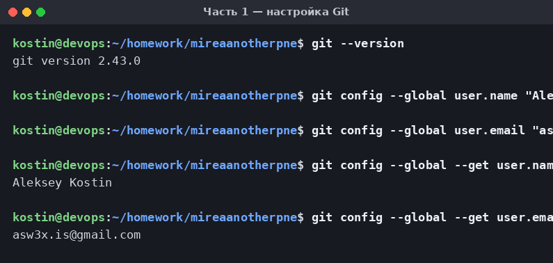

На GitHub создан публичный репозиторий **mireaanotherpne** без README, .gitignore и лицензии —
это важно, иначе удалённая ветка получила бы собственный коммит и первый `push` был бы отклонён
из-за расхождения историй.

## Часть 2. Работа с локальным репозиторием

Создана папка проекта, в ней инициализирован локальный репозиторий. Команда `git init`
создаёт служебный каталог `.git`, где Git хранит всю историю изменений.

Далее создан файл `story.txt` с первой строкой. Команда `git status` показывает файл как
**неотслеживаемый** (untracked) — Git видит его, но ещё не следит за его изменениями.
Команда `git add` переводит файл в индекс (staging area), а `git commit` фиксирует
состояние в истории.

```bash
git init
echo "This is the beginning of my story." > story.txt
git add story.txt
git commit -m "Add first line to the story"
```

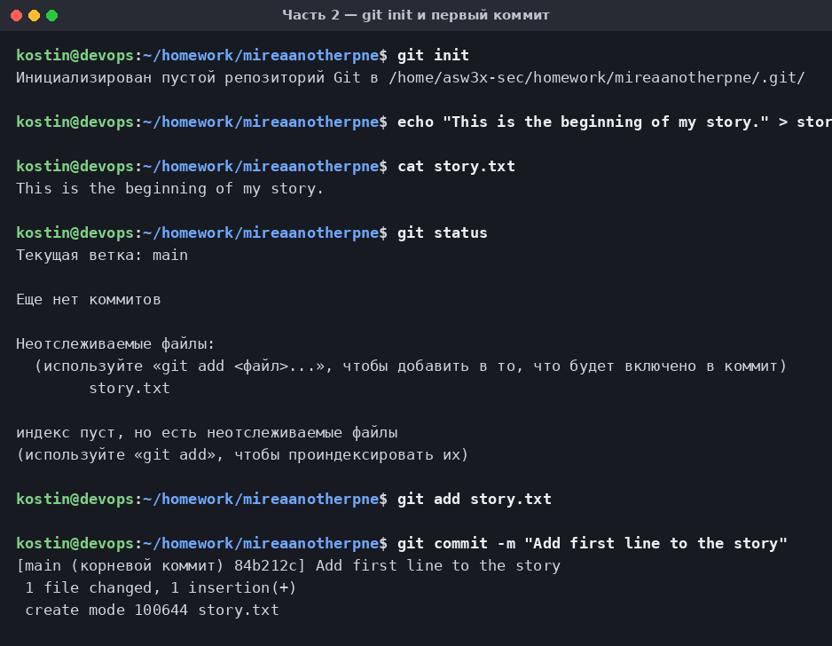

Затем в файл добавлена вторая строка и сделан второй коммит. Команда `git diff` до
индексации наглядно показывает разницу: строка `This is the beginning of my story.`
осталась без изменений, а строка `It was a dark and stormy night.` помечена как
добавленная (`+`).

```bash
git add story.txt
git commit -m "Add a classic opening line"
```

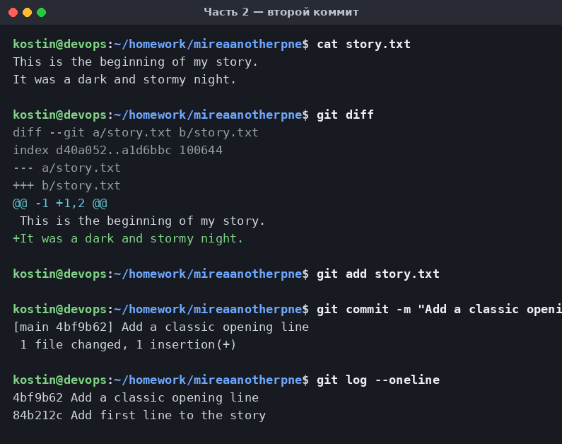

Содержимое `story.txt` на этом этапе:

```
This is the beginning of my story.
It was a dark and stormy night.
```

## Часть 3. Работа с ветками и создание конфликта

Создана ветка `test` и выполнено переключение на неё. Ветка — это подвижный указатель на
коммит; `git branch` выводит список веток, звёздочкой отмечена текущая.

В ветке `test` вторая строка заменена на «солнечный» вариант и сделан коммит.

```bash
git branch test
git checkout test
git commit -am "Make the story have a happy start"
```

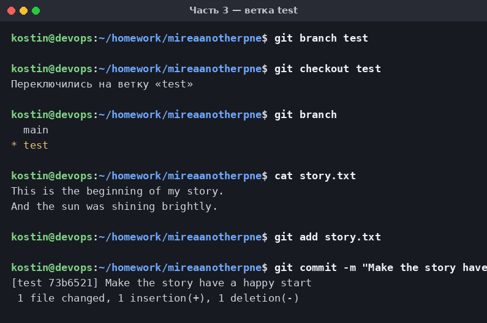

После возврата в `main` командой `git checkout main` файл `story.txt` автоматически принял
вид, соответствующий ветке `main` — вторая строка снова `It was a dark and stormy night.`
Это ключевая особенность веток: рабочий каталог перестраивается под выбранную ветку.

Затем **та же самая вторая строка** изменена по-другому — на драматичный вариант. Именно
изменение одного и того же места файла в двух ветках и создаёт конфликт слияния.

```bash
git checkout main
git commit -am "Make the story more dramatic"
```

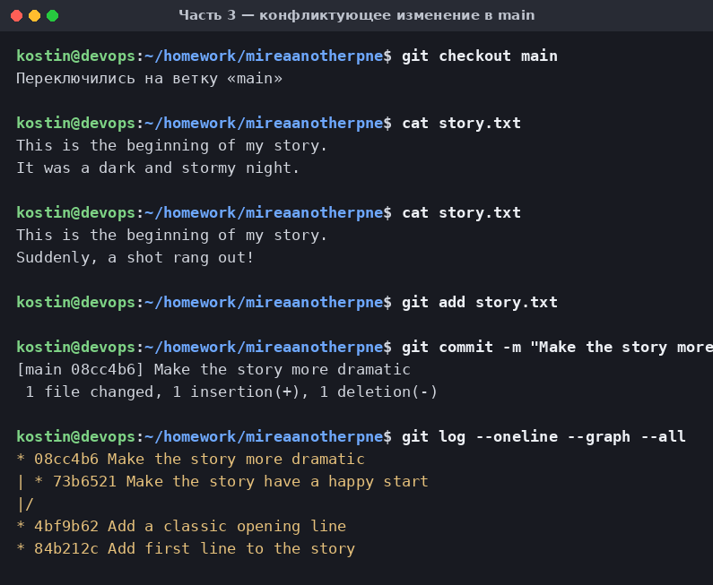

На этом этапе история разошлась на две параллельные ветки от общего коммита
`4bf9b62 Add a classic opening line`.

## Часть 4. Слияние и разрешение конфликта

Попытка влить ветку `test` в `main` ожидаемо завершилась ошибкой: Git смог определить, что
обе ветки изменили одну и ту же строку, но не может решить за разработчика, какой вариант
верный.

```bash
git merge test
# КОНФЛИКТ (содержимое): Конфликт слияния в story.txt
# Сбой автоматического слияния; исправьте конфликты, затем зафиксируйте результат.
```

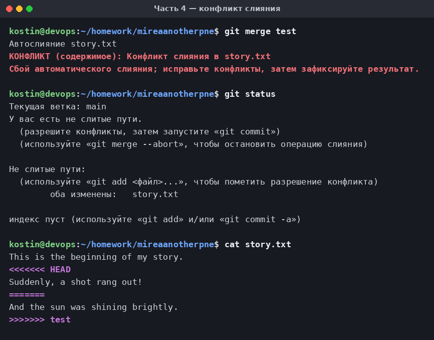

Команда `git status` показывает файл в состоянии **«оба изменены»** (both modified), а сам
файл размечен сигнатурой конфликта:

```
This is the beginning of my story.
<<<<<<< HEAD
Suddenly, a shot rang out!
=======
And the sun was shining brightly.
>>>>>>> test
```

Здесь между `<<<<<<< HEAD` и `=======` находится версия текущей ветки (`main`), а между
`=======` и `>>>>>>> test` — версия вливаемой ветки `test`.

Конфликт разрешён объединением обоих вариантов в одно предложение, все служебные маркеры
удалены. После этого исправленный файл добавлен в индекс — `git add` служит для Git
сигналом «конфликт разрешён» — и слияние завершено коммитом.

```bash
git add story.txt
git commit -m "Merge branch 'test' and resolve the plot conflict"
```

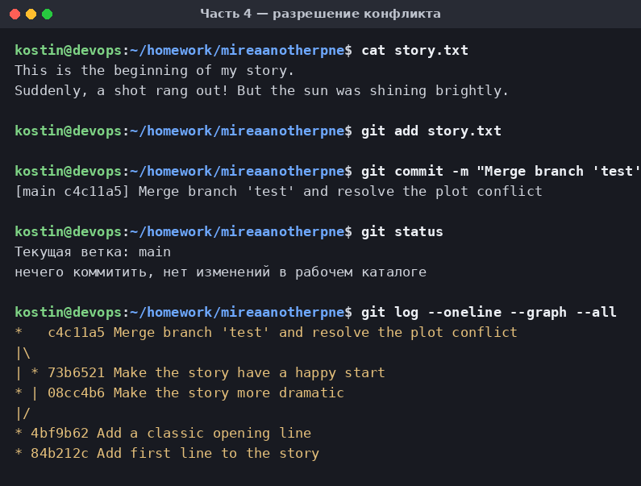

Итоговое содержимое `story.txt`:

```
This is the beginning of my story.
Suddenly, a shot rang out! But the sun was shining brightly.
```

### История коммитов с ветвлением и слиянием

```bash
git log --oneline --graph --all
```

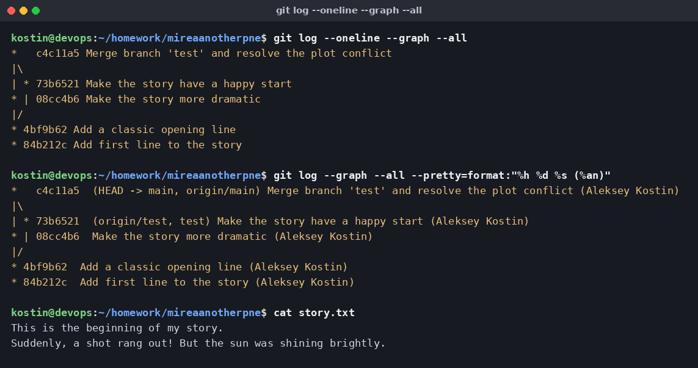

```
*   c4c11a5 Merge branch 'test' and resolve the plot conflict
|\
| * 73b6521 Make the story have a happy start
* | 08cc4b6 Make the story more dramatic
|/
* 4bf9b62 Add a classic opening line
* 84b212c Add first line to the story
```

На графе хорошо видна структура работы: два общих коммита, расхождение на две ветки
(`08cc4b6` в `main` и `73b6521` в `test`) и коммит слияния `c4c11a5`, у которого два
родителя — он и сводит обе линии разработки обратно в одну.

## Часть 5. Синхронизация с GitHub

Локальный репозиторий привязан к удалённому и отправлен на GitHub. Флаг `-u` устанавливает
связь между локальной веткой `main` и удалённой `origin/main`, благодаря чему в дальнейшем
достаточно короткой команды `git push`. Дополнительно отправлена ветка `test`, чтобы
ветвление было видно и на GitHub.

```bash
git remote add origin https://github.com/Asw3x/mireaanotherpne.git
git push -u origin main
git push origin test
```

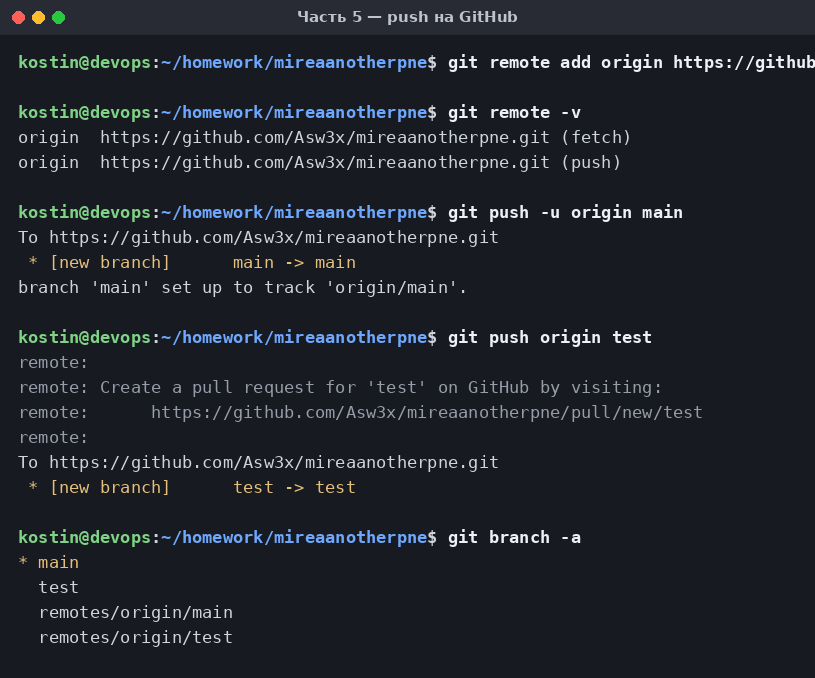

## Проверка результата на GitHub

Репозиторий опубликован, файл `story.txt` и история из 5 коммитов загружены успешно.

**Главная страница репозитория:**

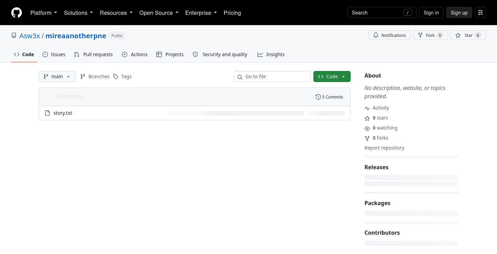

**История коммитов** — все пять шагов работы:

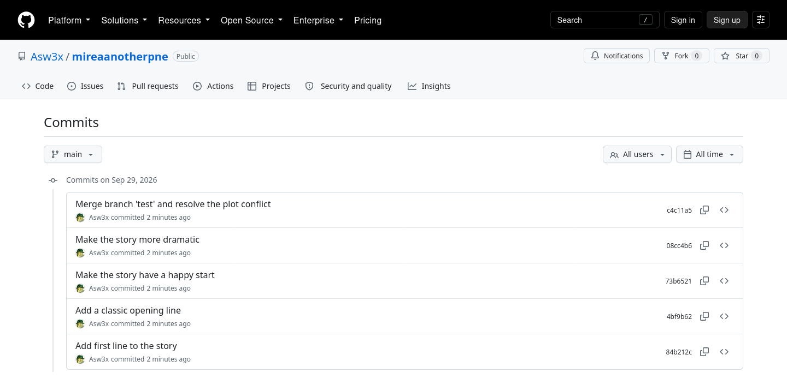

**Итоговое содержимое story.txt** после разрешения конфликта:

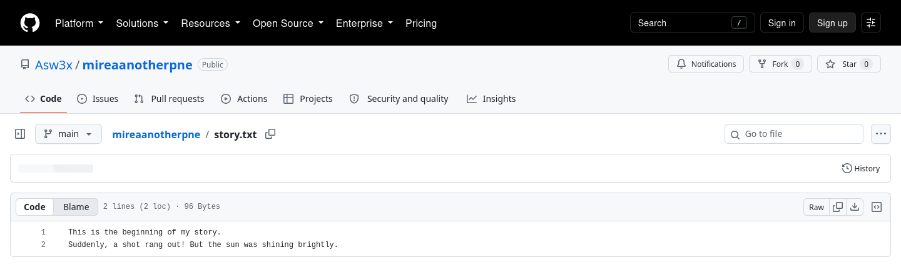

**Список веток** — обе ветки, `main` и `test`, присутствуют в удалённом репозитории:

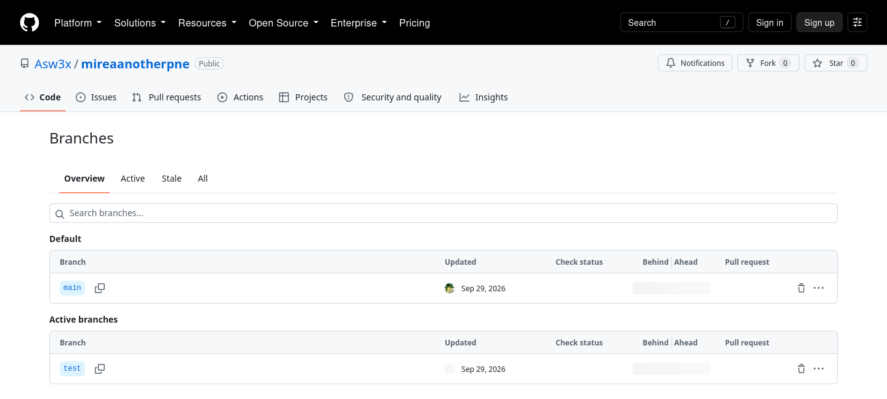

---

## Выводы

В ходе работы освоен базовый цикл работы с Git: инициализация репозитория, индексация
изменений и фиксация их в коммитах, создание веток для параллельной работы и слияние веток.

Главный практический результат — понимание природы конфликта слияния. Конфликт возникает не
из-за ошибки Git, а в ситуации, когда система принципиально не может выбрать между двумя
равноправными изменениями одного и того же фрагмента файла. Git честно останавливает
слияние, размечает спорное место сигнатурой конфликта и передаёт решение разработчику.
Разрешение сводится к трём шагам: привести файл к нужному виду, удалить все маркеры
конфликта и зафиксировать результат коммитом слияния.

Отдельно отработана синхронизация с удалённым репозиторием: связывание локального проекта с
GitHub через `git remote add` и отправка веток командой `git push`.

## Использованные команды

| Команда | Назначение |
| --- | --- |
| `git config --global user.name/user.email` | настройка автора коммитов |
| `git init` | инициализация локального репозитория |
| `git status` | текущее состояние рабочего каталога и индекса |
| `git add <файл>` | добавление изменений в индекс; после конфликта — пометка о его разрешении |
| `git commit -m "..."` | фиксация изменений в истории |
| `git diff` | просмотр изменений до индексации |
| `git branch` / `git branch <имя>` | список веток / создание ветки |
| `git checkout <ветка>` | переключение между ветками |
| `git merge <ветка>` | слияние указанной ветки в текущую |
| `git log --oneline --graph --all` | история коммитов в виде графа |
| `git remote add origin <URL>` | привязка к удалённому репозиторию |
| `git push -u origin main` | отправка ветки на GitHub |
